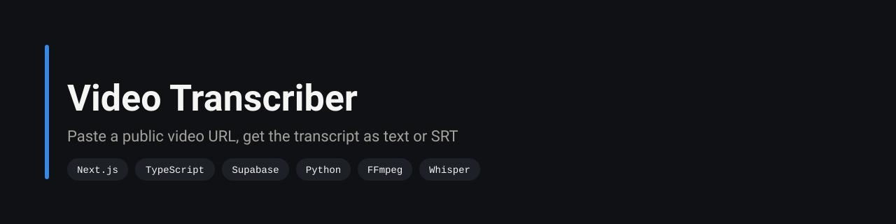
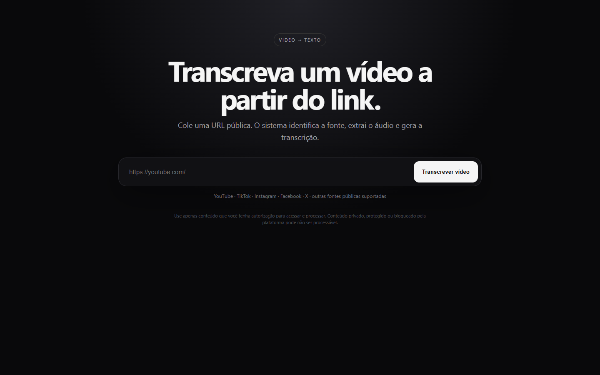
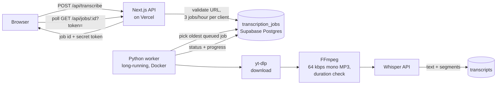

<p align="center">
  
</p>

<p align="center">
  <a href="https://video-transcriber-gilt.vercel.app"></a>
  
  
  
  
  
</p>

> Paste the link of a public video, watch the job move through download, audio extraction and transcription, and download the result as plain text or as SRT subtitles. **[Try it live](https://video-transcriber-gilt.vercel.app)**.

[](https://video-transcriber-gilt.vercel.app)

## Architecture



Transcription takes minutes; a Vercel function times out long before that. So the web side only creates and reads jobs, and a separate Python process does the work. Postgres is the queue: the worker polls for the oldest `queued` job, moves it through `downloading → extracting → transcribing → completed` with a progress percentage, and the page polls the same row.

## Details worth a look

| Area | How it works |
|---|---|
| Access control without accounts | Each job gets a random 48-character token. Reading a job requires its id **and** its token, so job ids can't be enumerated. |
| Abuse limit | At most 3 jobs per client per hour. The client IP is stored only as a SHA-256 hash salted with a server secret. |
| Input validation | HTTP/HTTPS only, 2,000-character limit, platform detected from the hostname. |
| Cost control | Audio is converted to 64 kbps mono MP3 before upload, and videos longer than 60 minutes (configurable) are rejected before calling the API. |
| Output | Plain text or SRT built from Whisper's timed segments, generated in the browser. |
| Secrets | The Supabase service key lives only on the server and in the worker; the browser never talks to Supabase directly. |

About 240 lines of TypeScript, Python and SQL. Design decisions are recorded in [`docs/decisions.md`](docs/decisions.md).

## Run it

1. Supabase: run `supabase/migrations/001_initial.sql` in the SQL editor.
2. Web (Vercel or local): set `SUPABASE_URL`, `SUPABASE_SECRET_KEY`, `JOB_HMAC_SECRET`, then `npm install && npm run dev`.
3. Worker (needs FFmpeg installed):

```bash
cd worker
cp .env.example .env      # SUPABASE_URL, SUPABASE_SECRET_KEY, OPENAI_API_KEY, OPENAI_TRANSCRIPTION_MODEL
python -m venv .venv && source .venv/bin/activate
pip install -r requirements.txt yt-dlp
python worker.py
```

For production, `worker/Dockerfile` runs it as a long-lived container.

## Engineering decisions

| Decision | Alternatives | Why |
|---|---|---|
| API and worker split | Everything in serverless functions | Download plus FFmpeg plus transcription does not fit a serverless timeout. |
| Postgres table as the queue | Redis + Bull, a managed queue | The job state has to be stored anyway, and one table serves as queue, status and history with no extra infrastructure. |
| Whisper API | Self-hosted faster-whisper | No GPU to run or pay for at MVP volume. |
| Capability token per job | User accounts | Lets anyone use it without signing up while keeping each result private to whoever created it. |

## Limitations

- Only public URLs that yt-dlp can reach. Private or login-protected content fails, and there is no attempt to bypass access controls.
- The worker takes a job with a read followed by an update. With a single worker that is fine; running several would need an atomic claim (`UPDATE ... WHERE status = 'queued' ... RETURNING`, or `FOR UPDATE SKIP LOCKED`).
- Videos over the duration limit are rejected instead of being split into chunks.
- No automated tests.

## Author

**Silvano Moraes de Souza**, Software Engineer · Python, APIs, automation and data in production
[LinkedIn](https://www.linkedin.com/in/silvano-moraes-de-souza) · [Portfolio](https://silvanomsouza.vercel.app/) · [GitHub](https://github.com/silvano-moraes-de-souza)
